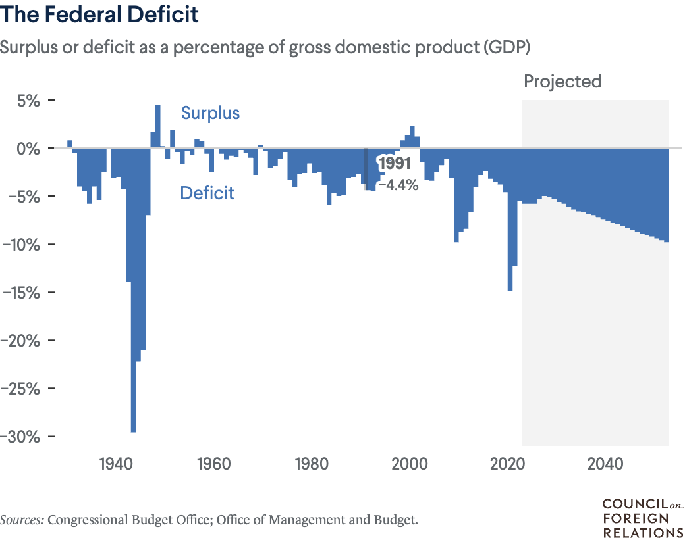

title: 杂谈
date: 2024-10-04

### 1. 美联储四年来首次降息

以下为[ CNBC 报道](https://www.cnbc.com/2024/09/18/fed-cuts-rates-september-2024-.html)：

WASHINGTON – The Federal Reserve on Wednesday enacted its first interest rate cut since the early days of the Covid pandemic, slicing half a percentage point off benchmark rates in an effort to head off a slowdown in the labor market.

“We’re trying to achieve a situation where we **restore price stability without the kind of painful increase in unemployment** that has come sometimes with this inflation. That’s what we’re trying to do, and I think you could take today’s action as a sign of our strong commitment to achieve that goal,” Chair Jerome Powell said at a news conference following the decision.

The decision comes despite most economic indicators looking fairly solid.

Gross domestic product has been rising steadily, and the Atlanta Fed is tracking 3% growth in the third quarter based on continuing strength in consumer spending. Moreover, the Fed chose to cut even though most gauges indicate inflation well ahead of the central bank’s 2% target. The Fed’s preferred measure shows inflation running around 2.5%, well below its peak but still higher than policymakers would like.

However, Powell and other policymakers in recent days have **expressed concern about the labor market**. While layoffs have shown little sign of rebounding, hiring has slowed significantly. In fact, the last time the monthly hiring rate was this low – 3.5% as a share of the labor force – the unemployment rate was above 6%.

以下为[美联社报道](https://apnews.com/article/interest-rates-inflation-prices-federal-reserve-economy-0283bc6f92e9f9920094b78d821df227)：

The rate cut, the Fed’s first in more than four years, **reflects its new focus on bolstering the job market, which has shown clear signs of slowing.** Coming just weeks before the presidential election, the Fed’s move also has the potential to **scramble the economic landscape just as Americans prepare to vote**.

所以综上所述:

* 确实有政治意图
* 但更多的是为了刺激就业市场
* FDR (美联储) 的主席 [Jerome Powell](https://en.wikipedia.org/wiki/Jerome_Powell) 是共和党人，在临近大选这个时候强调通货膨胀得到改善，显然不是为了自己党派的利益

### 2. 美国的经济可持续发展性

这是美国的[国债曲线](https://www.cfr.org/backgrounder/us-national-debt-dilemma#chapter-title-0-2)。

Economists at the Penn Wharton Budget Model estimate that financial markets cannot sustain more than twenty additional years of deficits. At that point, they argue, no amount of tax increases or spending cuts would suffice to avert a devastating default. “The debt doesn’t matter until it does,” says Maya MacGuineas, president of the bipartisan Committee for a Responsible Federal Budget. “By taking advantage of our privileged position in the global economy, we may well lose it.”

所以经济学家认为找其他国家借钱顶多借20年。